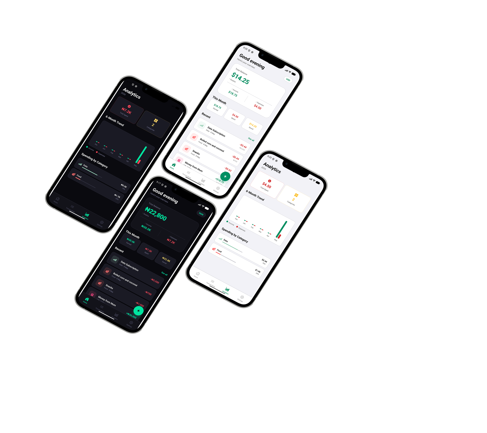
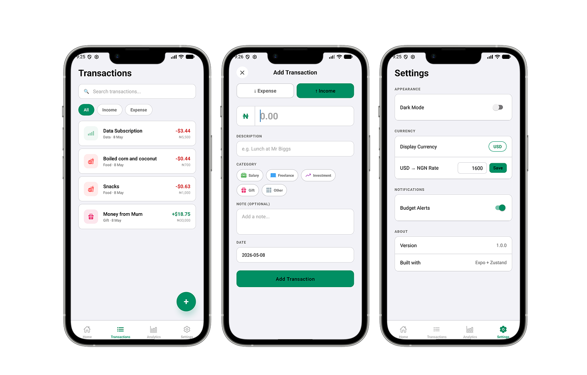
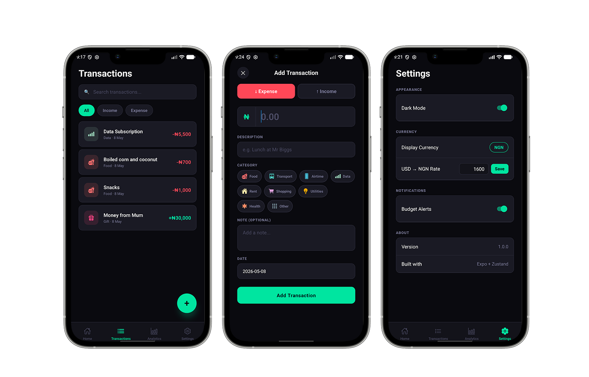

# Finance Tracker

A mobile-first personal finance app built with **Expo** and **React Native** that helps you log income and expenses, set category budgets, and visualise spending patterns — all stored locally on-device with no backend required.

Built with a Nigerian user in mind: supports both **NGN** and **USD** with real exchange rate conversion, so you can track your naira expenses and dollar freelance income in one place.

---

## Screenshots

> 
> 
> 

---

## Features

- **Add / Edit / Delete transactions** — income and expenses with title, amount, category, currency, date, and optional note
- **Multi-currency support** — NGN and USD with cached exchange rate conversion across all balances and totals
- **Category budgets** — set monthly spending limits per category and get a local push notification the moment you exceed one
- **Spending analytics** — pie chart breakdown by category and a 6-month income vs expense bar chart
- **Offline-first** — everything lives in a local SQLite database, no internet connection required
- **Persistent settings** — display currency, dark mode, and notification preferences saved across sessions

---

## Tech Stack

| Layer            | Technology               |
| ---------------- | ------------------------ |
| Framework        | Expo + React Native      |
| Language         | TypeScript               |
| Navigation       | Expo Router (file-based) |
| State Management | Zustand                  |
| Database         | expo-sqlite (WAL mode)   |
| Charts           | Victory Native           |
| Forms            | React Hook Form + Zod    |
| Notifications    | expo-notifications       |
| Persistence      | AsyncStorage (settings)  |

---

## Project Structure

```
FinanceTracker/
├── app/
│   ├── (tabs)/
│   │   ├── _layout.tsx         # Tab bar config
│   │   ├── index.tsx           # Dashboard screen
│   │   ├── transactions.tsx    # Transaction list
│   │   ├── analytics.tsx       # Charts & insights
│   │   └── settings.tsx        # App settings
│   ├── transaction/
│   │   ├── add.tsx             # Add transaction modal
│   │   └── [id].tsx            # Transaction detail / edit
│   └── _layout.tsx             # Root layout + DB init
├── db/
│   ├── database.ts             # SQLite init & seed
│   └── queries/
│       ├── transactions.ts
│       ├── budgets.ts
│       └── currencies.ts
├── store/
│   ├── useFinanceStore.ts      # Transactions + computed selectors
│   ├── useBudgetStore.ts       # Budget limits
│   └── useSettingsStore.ts     # User preferences
├── schemas/
│   └── transactionSchema.ts    # Zod validation
├── constants/
│   ├── categories.ts           # All category definitions
│   └── currencies.ts           # NGN / USD config
├── utils/
│   ├── formatCurrency.ts
│   └── dateHelpers.ts
└── types/
    └── index.ts
```

---

## Getting Started

### Prerequisites

- Node.js 18+
- Expo CLI — `npm install -g expo-cli`
- iOS Simulator / Android Emulator, or the **Expo Go** app on your phone

### Installation

```bash
# Clone the repo
git clone https://github.com/your-username/finance-tracker.git
cd finance-tracker

# Install dependencies
npm install

# Start the dev server
npx expo start
```

Scan the QR code with Expo Go, or press `i` for iOS simulator / `a` for Android emulator.

---

## Database Schema

The app uses four SQLite tables:

| Table            | Purpose                                                |
| ---------------- | ------------------------------------------------------ |
| `transactions`   | All income and expense records                         |
| `categories`     | Expense and income categories (seeded on first launch) |
| `budgets`        | Monthly spending limits per category                   |
| `exchange_rates` | Cached NGN/USD rates                                   |

Indexes are created on `transaction_date`, `type`, and `category_id` for fast filtering. The `budgets` table enforces a unique constraint on `(category_id, month, year)` so upserts are safe.

---

## Architecture

```
Screen
  └── Zustand Store (computed state + actions)
        └── SQLite Query (expo-sqlite)
              └── Updated state → UI re-render
```

- **Zustand stores** hydrate from SQLite on app boot and expose computed selectors (monthly totals, category spending, currency-converted balances) so screens stay clean
- **Currency conversion** happens inside selectors — raw amounts are stored in their original currency alongside the exchange rate at time of entry
- **Settings** are persisted to AsyncStorage separately from financial data

---

## Roadmap

- [ ] Cloud backup and optional account sync
- [ ] Receipt scanning with OCR for automatic transaction entry
- [ ] Nigerian bank alert parsing (Moniepoint, Opay)
- [ ] Savings goals with progress tracking
- [ ] Biometric lock and PIN protection

---

## License

MIT
